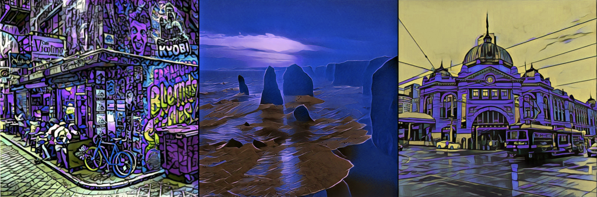

# [rOpenSci 2018 ozunconference](http://ozunconf18.ropensci.org/)
__(invitation only), Nov 22 - 23, 2018. Melbourne__

Welcome to the repository for the 2018 ozunconf.  rOpenSci will be hosting its fourth major developer meeting and open science hackathon this time in Melbourne, Australia.

* [Participants](http://ozunconf18.ropensci.org/#team)
* You can see the ideas for projects, discussion topics, and sessions as [issues](https://github.com/ropensci/ozunconf18/issues/)
* The projects that were worked on at the unconf are [here](http://ozunconf18.ropensci.org/projects/)

## Code of conduct

To ensure a safe, enjoyable, and friendly experience for everyone who participates, we have a [code of conduct](http://ozunconf18.ropensci.org/coc).  This applies to people attending in person or remotely, and for interacting over the [issues](https://github.com/ropensci/ozunconf18/issues/), other online venues and times outside the unconf.

## Support

This meeting is made possible by generous support from:

- rOpenSci
- Microsoft Azure
- The R Consortium
- RStudio
- The University of Melbourne
- The Monash Business School
